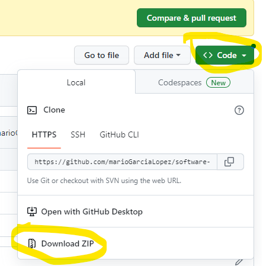
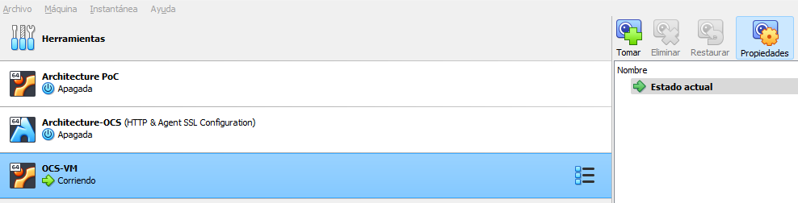
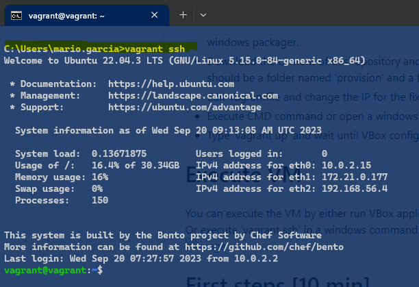
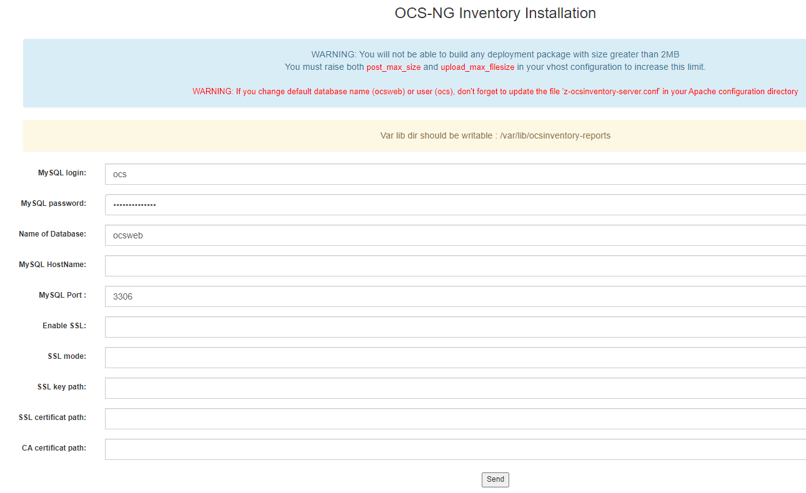
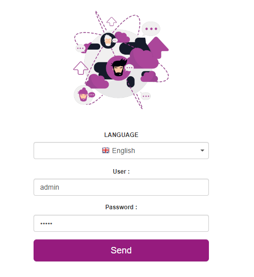
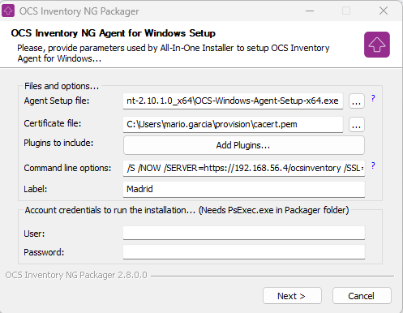
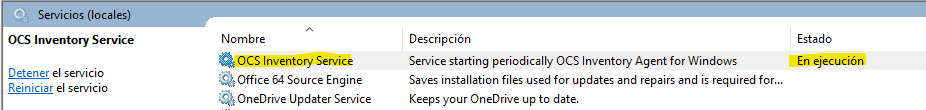

# Software-Services-OCS-Inventory
Repository of descriptive nature for the installation process related to the OCS-Invertary tool in Fertiberia group company. The complete installation process is estimated to last about 1 hour and 10 min and the knowledge base to execute it is linux basic user OS. 
# Requirements   
In order to complete the installation guide, the following programs must be downloaded:     
- Virtual Box: https://www.virtualbox.org/wiki/Downloads (Select the convenient distribution)
  Follow installation wizard. 
- Vagrant: https://developer.hashicorp.com/vagrant/downloads (Select the convenient distribution)
  Follow installation wizard. 
- OCS-Agent Windows64: https://github.com/OCSInventory-NG/WindowsAgent/releases/download/2.10.1.0/OCS-Windows-Agent-2.10.1.0_x64.zip
- Windows Packager: https://github.com/OCSInventory-NG/Packager-for-Windows/releases/download/2.8/OCS-Windows-Packager-2.8.zip   
  To be able to execute this program, it is also needed the following Microsoft package: https://download.sysinternals.com/files/PSTools.zip
- A fixed IP Address for the VM. This is important so the VM is accesible from any agent on the network. The IP shoud be unique and out of the range of the DHCP server.   
  **Important:** The machine executing Vagrant **must have** virtualization option enabled in the BIOS. 

 # Installation Process   
 - Install Virtual Box and Vagrant programs [about 20 min] using the default wizard options.
 - Install the OCS-Agent by unzipping the downloaded file to a local directory.
 - Unzip the Microsoft tools PSTools to a local directory.
 - Unzip the windows packager to a local directory and execute the exe file. In the popup installation window, indicate the local directory where PSTools has been unzipped previously. After the initial configuration, close the windows packager.
 - Download the content of this repository and unzip it in the user directory [ex: c:\Users\mario.garcia]. There should be a folder named 'provision' and a file named 'Vagrantfile'.   
       
   
 - Edit Vagrantfile and **change the IP for the fixed IP address (Line 3)**. Instead, an environment variable 'IP' can be defined with the IP value, so this change would not be needed.   
   **Important Note:** This IP should be part of an internal network. Make sure to avoid any conflicts with existing DHCP servers.  
 - Execute CMD command or open a windows terminal.
 - Type 'vagrant up' and wait until VBox configuration is finished.[25 min]

# Execute VM    
You can execute the VM by either run VBox application and open the VM (with credentials vagrant/vagrant):   
           
   
Or execute 'vagrant ssh' in a windows command terminal:   
      
 

# First steps [10 min]
As first thing to do, a navigator window should be opened in the HOST machine (not the VM) and access the address: https://VM-IP/ocsreports. The install initial page will be opened:   
  
Introduce the data as in the image:  
- MySQL login: ocs
- MySQLPassword: strongPas5w0rd
- Name of Database: ocsweb
- MySQL port: 3306

In the next window, click on 'click here to enter OCS-NG GUI'; A notice of upgrading the DB will be shown: press 'upgrade' and access the next window.   
Once updated click again in 'OCS-NSG GUI' to access the login page:   
     
The default credentials are admin/admin   
Once registered access the menu: configuration->users, select user admin and change the default password.   
   
Enter a terminal window in the VM and remove the default installation file:   
- sudo rm -f /usr/share/ocsinventory-reports/ocsreports/install.php
  

# Agent Package Creation [15 min] 
- Execute the windows packager program (ocsPackager.exe) and fill the following information:   
   
 
Agent Setup File: Select the exe file of the agent. (Mind to remove the filter name in the popup selection window)
Certificate file: Select file 'cacert.pem' in the 'provision' folder of this repository.   
Command line options: /S /NOW /SERVER=https://IP_VM/ocsinventory /SSL=1 /NOSPLASH /NO_SYSTRAY   
(Be aware <IP_VM> should be change for the VM IP)    
/S – Silent   
/NOW – Run Inventory immediately after installation   
/SERVER=https://IP_VM/ocsinventory – address for reporting, mind the suffix – it’s not ocsreports like for web console!   
/SSL=1 – force using SSL   
/NOSPLASH – no splash screen at startup   
/NO_SYSTRAY – no systray – no need to bother users with new icons. Besides, user notification and interaction work perfectly without it.

Tag: It's important to add the location as 'Label' for the agent. In the image example, Madrid is the tag value to be informed.    
Press 'next' button and select output file folder and name in the next one. In this example, the agent installer name is: 'OCSPackage.exe'.   
Press OK again in the next window and wait for the file to be generated.   

Once the file is generated, it can be executed in the different PCs and servers. The installation is silent; when it's finished, a new service would be found in the 'Services' panel of the SO:   

   

A simple way of installing the agent to all the connected computers in the network, would be using 'psexec.exe' program from Microsoft:   
- psexec \\* -s \\ROUTE_TO_PKG_AGENT\OCSPackage.exe     

# Final Optional Steps   
The process will create a VBox VM ready to be used. The default password for the DataBase connection is 'strongPas5w0rd'. To change this password, execute the following steps:   
- Enter a terminal in the VM (either entering from VBox or in a windows terminal in the Host machine typing: 'vagrant ssh')
- Execute a sql command to change the password for the user:
     sudo mysql -u vagrant -p'vagrant' -e "ALTER USER 'ocs' IDENTIFIED BY 'newpassword';"   
- Execute the following lines to change the password configuration for the OCS application files:   
     sudo sed -i 's/strongPas5w0rd/newpassword/g' /etc/apache2/conf-available/z-ocsinventory-server.conf   
     sudo sed -i 's/strongPas5w0rd/newpassword/g' /etc/apache2/conf-available/zz-ocsinventory-restapi.conf   

Another consideration to take into account is the DB configuration. Currently, for security reasons, the DDBB can only be accessed from the VM localhost. This case may be changed in the following configuration file: 
- /etc/mysql/mariadb.conf.d/50-server.cnf
This file has a variable 'bind address = 127.0.0.1' which can be changed for a range IP, so the DB would be accessed from any other machine from the network, for ex:
- sudo sed -i 's/127.0.0.1/192.168.56.0/g' /etc/mysql/mariadb.conf.d/50-server.cnf

# Additional Policies and Scripts   
Depending of the configuration for the active directory, a group policy could be configured and added a control script for the init session event. This script is under the folder 'policy' and is written to check whether the agent is active or not. In case is not active, the script will init the service. In case is not installed, the script will install the agent, which should be stored in a reachable network location. This script can be parametrized changing the value of the variables: 'agentName' (with the name of the agent exe file generated with the package tool) and 'programRoute' (with the reachable network location where the agent exe file would be located).   
Please, check whether the Active Directory configuration of the network is suitable for this scenario or not. If users cannot have any permission related to the local services, it won't be a good idea. Also, check if it would be necessary only for specific groups in the network, according to the local policies.   

# Conclusion   
The VM has a self signed certificate to encript communication for accessing the OCS-Inventary application; also, all the agents installed with the installed package program created in the guide will encrypt the communication towards the repository server with the RSA algorithm using the public-private key generated.  
The OCS application provides a wide echosystem of plugins available to extend functionality. In future updates of this repository, new functionality would be added to include new company policies. 

The official documentation for the application can be found at:  
- https://wiki.ocsinventory-ng.org/   
   
Plugins catalog for the product:   
- https://plugins.ocsinventory-ng.org/#modal-winupdate

  
